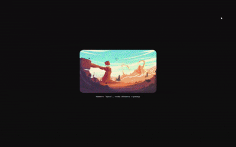

## Практикум Docker - создание веб-приложения в контейнере

[Github репозиторий, откуда брал изображения](https://github.com/DenverCoder1/minimalistic-wallpaper-collection)

**Для сборки:**
```bash
docker build -t bottle-app .
```
**Запустить образ:**
```bash
podman -d -p 5000:5000 --name bottle localhost/bottle-app
```

**Содержимое `Dockerfile`:**
```Dockerfile
# our base image
FROM alpine:latest

# install python and bottle
RUN apk add --update --no-cache python3 py3-bottle

# set workdir
WORKDIR /app

# copy files required for the app to run
COPY main.py .
COPY index.html .
COPY static/ ./static/

# tell the port number the container should expose
EXPOSE 5000

# run the application
CMD ["python3", "main.py"]
```
**Результаты работы:**


