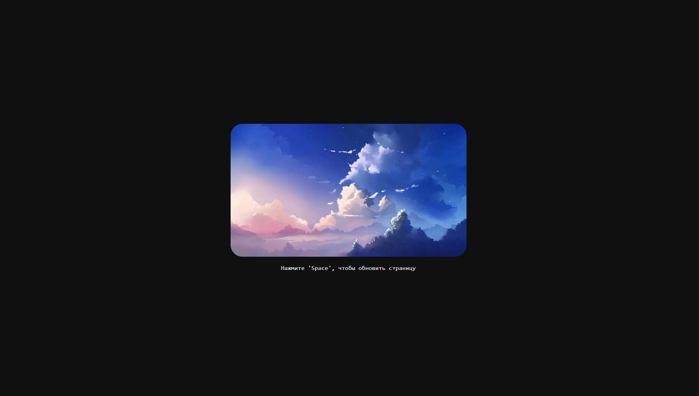

## Лабораторная работа 

[Github репозиторий, откуда брал изображения](https://github.com/DenverCoder1/minimalistic-wallpaper-collection)

Для сборки:
```bash
docker build -t bottle-app .
```
Запустить образ
```bash
podman -d -p 5000:5000 --name bottle localhost/bottle-app
```

Результаты работы:


